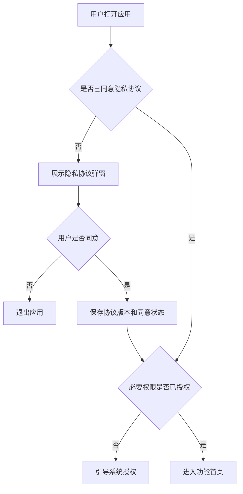

# 写作风格指南

本文件定义通用写作风格。域文件（`domains/more/*.md`）中的「写作风格偏好」节可覆盖本文件的通用规则。加载域文件后，优先级为：域文件写作偏好 > 本文件通用规则。

## 一、语气与风格

默认语气：

- 直接、产品交付导向，写给研发、测试、设计和评审会看。
- 低营销调性。简要说明业务价值后，迅速进入范围和行为描述。
- 偏好短句和具体规则。允许略带操作感的措辞。
- 使用直接动词：`用户点击`、`系统判断`、`展示`、`进入`、`保存`、`上报`、`置灰`、`弹窗提示`、`toast 提示`、`跳转至`。
- 中文产品术语与必要英文技术术语混用：`APP`、`H5`、`CMS`、`BLE`、`OTA`、`Token`、`toast`、`webview`、`API`。

核心原则：

1. **描述用户可感知的行为**。正确："用户点击确认后，页面跳转至设备列表，顶部 toast 提示'添加成功'。" 错误："系统调用 addDevice API，返回 200 后触发 UI callback 刷新列表。"
2. **用"若…则…"句式写条件逻辑**。复杂逻辑拆成条件句。
3. **状态描述要具体**。文案不确定时写"待文案确认"，但要描述提示意图。
4. **段落控制**：单段连续文字不超过 3-4 行，超了拆成编号列表。

整体风格补充：

- 用简洁的产品经理中文撰写。
- 复杂逻辑使用结构化表格和有序列表。
- `不涉及` 仅在明确检查了该章节后使用；否则用 `待确认`。
- 把 `二、需求背景` 和 `5.3 功能说明` 作为主体。其他章节保持简洁。
- 不要填充无关的历史非功能性章节。尊重用户当前模板。

## 二、避开开发态描述

PRD 阶段聚焦用户体验流程与交互规则，避免定义实现细节：

| 不写 | 改写为 |
|-|-|
| 字段名 `user_name VARCHAR(50)` | 用户名字段 |
| `max_length=50` | 限制字符数（具体值待概要方案确认） |
| 弹窗尺寸 `360x240px` | 弹窗居中展示，含标题、说明、确认/取消 |
| 接口超时 `timeout=5000ms` | 加载超过合理时长后展示重试入口 |
| 数据库表名 `tb_user_settings` | 用户设置数据 |
| HTTP 状态码 `401` | 登录态失效场景 |
| 接口名 `/api/v2/login` | 登录接口（具体路径待开发对齐） |
| 缓存策略 LRU/TTL | 不写，属于概要方案范围 |

写作焦点：

- **用户能看到什么**：页面元素、状态、提示文案意图。
- **用户能做什么**：操作、跳转、取消、重试、批量。
- **系统对用户的反馈**：成功/失败/中间态的可见结果。
- **业务规则**：什么场景生效、失效、降级。

如果用户明确要求 PRD 中包含某些技术参数（如最低 Android 版本、SDK 版本），按用户要求保留。

## 三、去 AI 味必检清单

### 禁用短语 → 改写方向

| 禁用短语 | 改写方向 |
|-|-|
| 全面赋能用户 / 赋能用户 | 写清楚用户能做什么具体操作 |
| 打造极致体验 | 用具体交互行为/状态/反馈替代 |
| 构建智能化闭环 | 描述触发条件、输入、输出、降级逻辑 |
| 深度提升产品价值 | 指明哪个流程/状态/操作被改善 |
| 显著提升效率 | 写清楚具体节省了什么步骤或时间 |
| 保障稳定可靠 | 写 loading、重试、超时、失败、降级行为 |
| 无缝衔接 | 描述具体衔接方式和过渡状态 |
| 智能推荐 | 写清推荐规则/依据/触发条件 |
| 流畅、优雅、直觉化 | 描述具体交互步骤和反馈 |

### 终检清单（逐段检查）

1. 有没有空洞价值陈述？→ 删掉或改为具体行为。
2. 有没有"首先…其次…最后…"八股？→ 改为平铺或编号列表。
3. 有没有主语模糊的被动句？→ 改为明确主语（用户/系统/设备）。
4. 有没有过度修饰？→ 删形容词，保留动词和名词。
5. 有没有不必要的总结段？→ 功能说明结尾不需要"综上所述"。
6. 是否每段都在传递新信息？→ 重复的话删掉。

### 执行要求

保持事实、产品名、优先级、日期、表格字段、`待确认` 项不变。保持结构化 PRD 格式，表格类章节不转散文。不发明法律结论、最终 UI 文案、指标或协议细节。

## 四、需求背景写法

好的背景应连接：

- 为什么现在做（时机）
- 谁受影响（用户/场景）
- 当前行为或替代方案
- 数据/研究/竞品信号（有则引用）
- 业务或用户后果

不要写成通用行业分析散文。

## 五、DOCX 输出格式规范（可选输出）

输出 DOCX 文件时遵循以下约束：

### 字体与颜色

- 全文字体：微软雅黑
- 全文颜色：黑色
- 唯一例外：`[待确认: xx]` 使用红色字体

### 标题字号

| 层级 | 对应内容 | 字号 | 样式 |
|-|-|-|-|
| 文档标题 | "XX 产品需求规格说明书" | 小一号 | 加粗 |
| 标题1 | 一、二、三…七、附录 | 小二号 | 加粗 |
| 标题2 | 1.1、2.1、5.3… | 三号 | 加粗 |
| 标题3 | 5.3.1、5.3.2… | 四号 | 加粗 |
| 正文 | 段落、表格内容 | 11号 | 常规 |

### 文案标注

正文中 UI 文案（toast、按钮文字、页面标题）使用**下划线 + 斜体**格式。

### 表格格式

- 标题行：加粗 + 居中 + 背景填充 #F3F5F7
- 内容行：左对齐，正文 11 号

## 六、Mermaid 流程图规范

### 工具选择

- 快速文本流程图/状态图/序列图：使用 Mermaid。
- 已有原型工具链接：直接引用，不发明最终 UI。

### 产品流程图

画图前确认：起始/终止状态、用户角色、入口点、前置条件、决策节点、成功路径、失败/重试/取消/降级路径、数据保存节点。

示例：

### 状态图

用于设备连接、登录、支付、生成、上传、审核等工作流。必须覆盖初始/中间/成功/失败状态和重试/取消转换。

### 图表质量标准

一张图聚焦一个流程，大流程按模块拆分。使用产品术语，不用纯工程名称。失败分支标注用户可见结果。关键流程不省略取消、关闭、返回、重试、超时行为。
